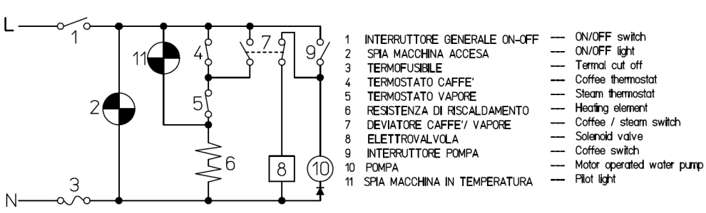
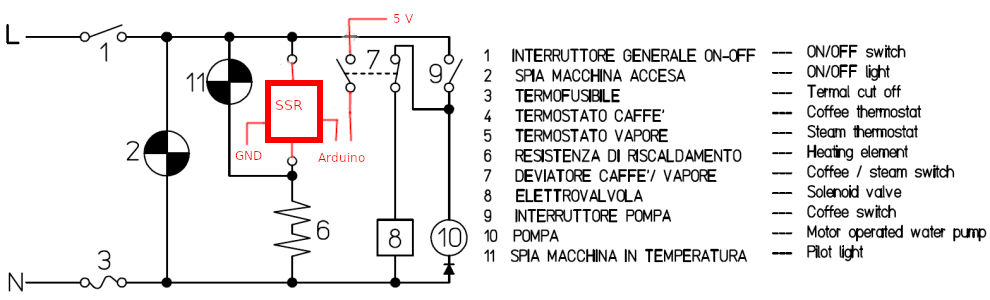

# Gaggia PID Controller

This project is a PID controller for a `Gaggia Paros` (or Gaggia Classic) coffee machine using Arduino and a few other components.
This Arduino based controller improves the stability of the water temperature of the coffee machine by controlling the boiler with a PID control loop feedback.

## Software

### Arduino libraries

This project depends on the following Arduino libraries:
- [PID](https://github.com/br3ttb/Arduino-PID-Library)
- [TSIC](https://github.com/Schm1tz1/arduino-tsic)
- [SDD1306Ascii](https://github.com/greiman/SSD1306Ascii)

### Build

You can build the code using the Arduino IDE or with VSCode with the [Arduino extension](https://marketplace.visualstudio.com/items?itemName=vsciot-vscode.vscode-arduino) opening the `GaggiaPIDController.ino` sketch.

#### Build with Docker

The code can be built inside a Docker container using docker-compose. The `docker-compose.yml` and the `Dockerfile` are in the `docker` directory. The `docker-compose.yml` depends on 2 environment variables that must be defined before starting the build:
- CORE: the Arduino core
- BOARD: the Arduino board to use

Refer to the [arduino-cli](https://arduino.github.io/arduino-cli/) documentation for the list of available cores and boards.
The following is an example that builds the code for an Arduino Nano board:

```
$ cd /path/to/repo
$ CORE=avr BOARD=nano docker-compose -f docker/docker-compose.yml up
```

The generated build files will be in the `build` directory.

After building the Docker image the first time, you can then use the `arduino-cli` installed in the Docker image directly with:

```
$ cd /path/to/repo
$ docker run --rm -it -v $PWD:/build arduino-builder arduino-cli version
arduino-cli Version: 0.10.0 Commit: ec5c3ed
```

## Hardware

### Components

This is the list of components required for this project:
- 1x Arduino (any board type will do)
- 1x Solid State Relay 40A
- 2x Digital temperature sensor TSic306
- 1x I2C OLED
- Wires and other utilities

### Schematics

The following is the original schematic of the coffee machine:



This in how it looks with the Arduino controller and the SSR:



The 2 stock thermostats are being replaced by 2 TSic306 digital sensors.

## Credits

A big thank you goes to these two other projects that helped me a lot in the understanding of the electric schematics of the coffee machine and the components to use:
- [RaspberryPI based](http://int03.co.uk/blog/project-coffee-espiresso-machine/)
- [Arduino based](http://www.cyberelectronics.org/?p=458)
