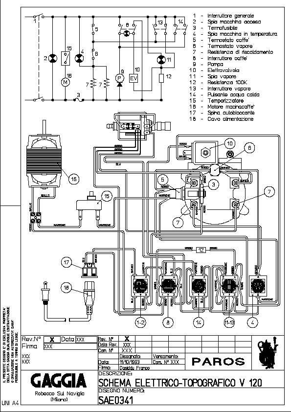
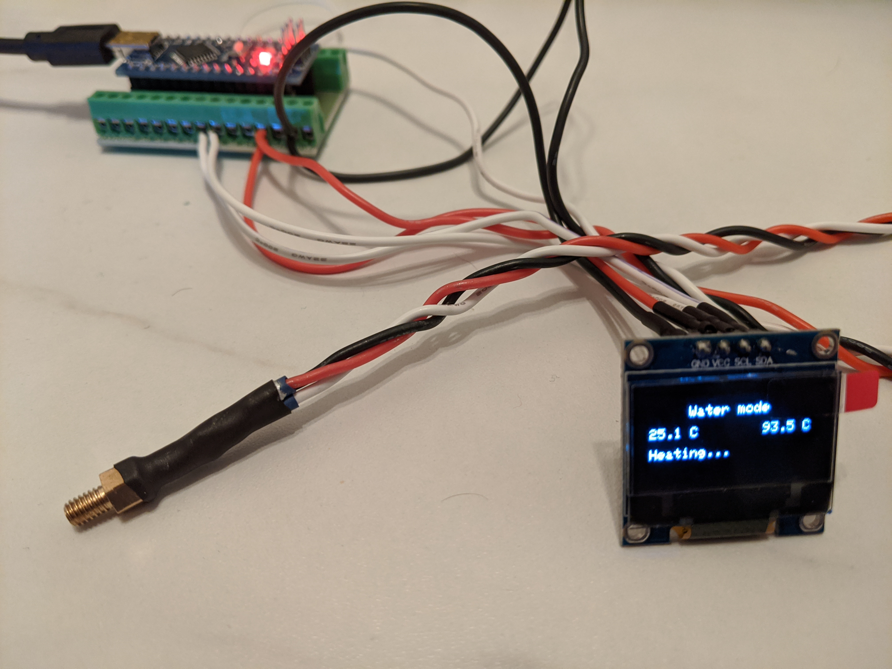
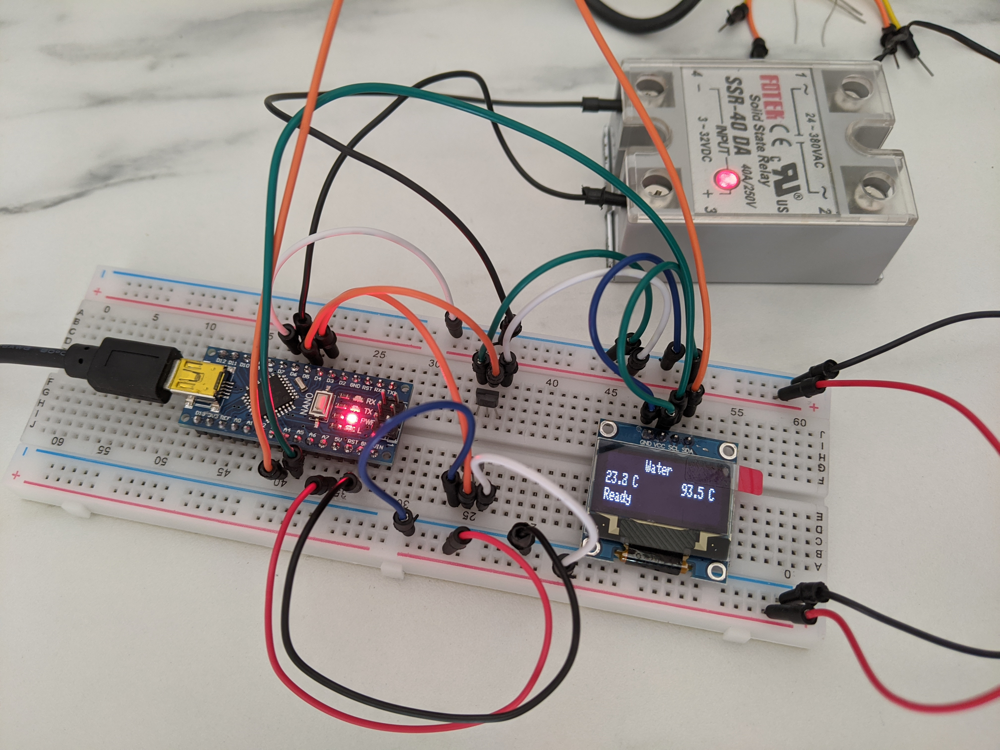

GaggiaPIDController's documentation
###################################

.. toctree::
   :maxdepth: 1
   :numbered:

.. important:: This project is a work in progress, I will update the documentation while
   I progress with the work and things might change along the road

Introduction
************

``GaggiaPIDController`` is a modification for Gaggia coffee machines replacing the
existing thermostats with a PID controller powered by Arduino.
I am confident that this modification could be applied to other machines too, but
in this documentation I will describe how I applied this modification to a ``Gaggia Paros``.
The``Gaggia Paros`` is almost identical in its parts to a ``Gaggia Classic`` and it comes
combined with a coffee grinder.

To add a PID controller to the coffee machine we'll need to replace the existing
thermostats that control the heater. There are 2 thermostats to allow the operation
of the machine heating water to brew temperature and also steam temperature.
Unfortunately these thermostat have a wide working range, meaning that they don't keep
the water/steam temperature stable enough to allow consistency of the brewed coffee.

Overview
********

This is the electric diagram of the ``Gaggia Paros``:

    Gaggia Paros electrical wiring

The switches ``5`` and ``6`` represents the two thermostats that are going to be replaced
with two digital temperature sensors and a Solid State Relay that the Arduino MCU will
use to directly control the heater.
The second modification required to allow to target the correct temperature is to
connect Arduino to the left pins of the "double switch" ``13``. This will allow the MCU
to know if the Steam button has been pressed.

This is the list of materials I used for this project. The purpose here is to just give
an idea of what I used and you can change anything as you might prefer:

* TSic 306 digital temperature sensor (x2)
* 128x64 OLED with SSD1306 controller
* Arduino Nano
* Arduino Nano expansion connection shield
* Fotek clone SSR 40A
* Wires 22AWG (low voltage) and 18AWG (AC line)
* Heat shrinking sleeves
* T-tap (scotch) connectors
* Thermal paste
* M4 brass hexagonal standoff

Arduino
*******

I decided to use an Arduino Nano because of the small size and the USB mini port which
is handy to upload sketches and interface with the Serial.
I decided to not use a PCB but instead I connected the Arduino to an expansion board that
allow you to connect wires with screw connectors without having to solder anything.
Also I did not need a PCB as the only other components outside the coffee machine is
going to be the display.

Temperature sensors
*******************

For this project I decided to use the TSic 306 digital temperature sensor. As suggested
in similar projects there are several benefits: it's digital so no need for ADC or
external bridge boards, max operational temperature is +150deg C which is perfect as the
steam needs to get around 145deg C and it comes in a TO92 package which is quite compact.

.. warning:: How I approached this step is definitely not the best way and there is
   the risk of damaging the sensors. Unfortunately I had to deal with lack of tools

Fitting the temperature sensor was probably the "hardest" part of this project: the
obstacle here was to figure out how to plug the sensor in the machine's heater. The
stock thermostats are connected through a M4 screw, so following advice from other
similar projects I bought a couple of brass hexagonal standoff with a M4 male thread and
I tried to find a way to assemply the sensors into them.

Unfortunately the TO92 package is 4.5mm wide so I used some sand paper to smooth the
corners of the sensors, trying to not damage the internal electrics. Ideally I would
have drilled the M4 female thread but I do not have a drill at hand :(

I filled the female thread with thermal paste and then I inserted the sensors in the
paste. Eventually I covered everything with a heat shrinking sleeve.

    Temperature sensor assembled

Solid State Relay
*****************

I used one of the common (and cheap) Fotek clone SSR. From what I could read online
these clones usually contain underrated triac, so to stay on the safe side I bought the
40A version with the hope it's not going to blow up.
This type of SSR can be controlled with a signal in the range 3-32 VDC and they update
the output when the AC signal crosses its zero level.

The SSR can be placed inside the coffee machine and the control signals are going to be
wired outside to be connected to the Arduino board.

Power supply
************

There might be different ways to power the "low voltage" electronic for this project,
at first I thought to use AAA batteries as the overall consumption is very low and the
whole circuit is on only for 30min a day in average.
Eventually I decided to take power from the main AC source using T-Tap connectors and use
a AC-DC converter recycling a cheap USB charger I had sitting in a drawer.

After opening the USB charger up, I soldered two wires to replace the socket power plugs
and on the other side of the circuit I removed the USB port exposing the 5V line to
other two separate wires.

Eventually I enclosed the whole circuit board in 3D printed plastic case leaving it inside
the coffee machine, as far as possible from any other components. The 5V lines has been
wired outside the coffee machine to reach the Arduino board.

.. figure:: images/power_supply.png
    :align: center
    :alt: Power supply enclosure

    Power supply enclosure

Display
*******

There is not a constraint on what display you can use, in my case I chose an OLED 128x64.
This display uses the ``SSD1306`` controller and you can find several Arduino libraries
that let you interface with the display.
The main reason to choose this type of display was that it uses the I2C protocol so I
only needed 2 Arduino pins to control it (plus 2 for power it up).

Enclosure
*********

The Arduino (with its expansion board) and the display are being mounted outside the
coffee machine in their own enclosure.
I designed a very basic and simple case and I 3D printed it with PLA plastic.
I then mounted the enclosure in between the coffee brew head and the grinder as there
is a gap.

.. figure:: images/external_enclosure.png
    :align: center
    :alt: External Arduino enclosure

    External Arduino enclosure

Assembly
********

In this section I'll recap the steps I took from the beginning, until the final
assembly with the PID controller integrated in the coffee machine.

Once gathered all the materials, which took several weeks due to the lockdown, for
initial testing I wired everything on a breadboard to verify that the code was working
as expected:

    Testbench assembly

This also helped me to find a good starting point for the PID gains, at least better than
leaving them set to ``1``. They have been tuned once everything was connected to the
machine heater.

* Assemble the temperature sensor, fitting them into the hexagonal brass spacers with the
  thermal paste and soldering the 22AWG wires
* Solder some wires to the display pins, to allow the connection to the arduino expansion
  shield
* Prepare two pieces of 18AWG cable soldering a male spade connector on one end of each
  wire piece. The other ends are going to be connected to the SSR AC ports
* Solder two female spade connectors to two pieces of 22AWG wire. These are going to be
  used to detect the position of the steam switch
* Assemple the external enclosure fitting the display and the Arduino Nano plugged in
  the expansion shield

Now it's time to move things in the coffee machine. After opening the enclosure you'll
need to:

* Disconnect two female spade connectors from the switch 13. Make sure to disconnect
  those two connected with the ``brown`` wire
* Plug the two 22AWG wire to the now free male switch pins. The other ends needs to be
  connected to the Arduino expansion shield, one to the 5V and the other to the pin
  allocated to the switch state detection
* Unscrew the two thermostats from the heater and unplug the spade connectors. From each
  thermostat, keep the connectors with the ``brown`` and ``white`` wires aside
* Connect the SSR wires to the two connectors kept aside in the previous step and the
  other ends to the SSR AC ports. Place the SSR inside the coffee machine
* Connect the SSR control ports with two wires going to the Arduino expansion shield
* Screw the temperature sensor in the heater where the thermostats were and connect
  the wires to the Arduino expansion shield
* Apply the T-Tap connectors to the coffee machine input AC line and connect the AC/DC
  converter to the T-Tap female connectors. Place the power supply inside the machine, far
  from anything else and connect the 5V line wires to the Arduino expansion shield ``Vin``

After that you can close the coffee machine making sure that all the "Arduino connections"
are wired out to the external enclosure. To recap you should have the following wires:

* 2 wires from the power supply (5V + Ground)
* 3 wires from the water temperature sensor (5V + Ground + Signal)
* 3 wires from the steam temperature sensor (5V + Ground + Signal)
* 2 wires from the SSR (Signal + Ground)
* 2 wires from the steam switch (5V + Signal)

Connect all the wires to the appropriate port in the Arduino expansion shield and mount
the external enclosure on the coffee machine.

This is how the Paros looks like after the modification:

.. figure:: images/final_mod.png
    :align: center
    :alt: Final assembly

    Final assembly

Enjoy the coffee!