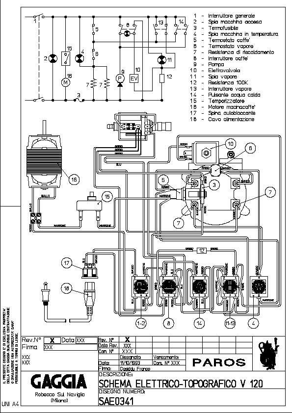
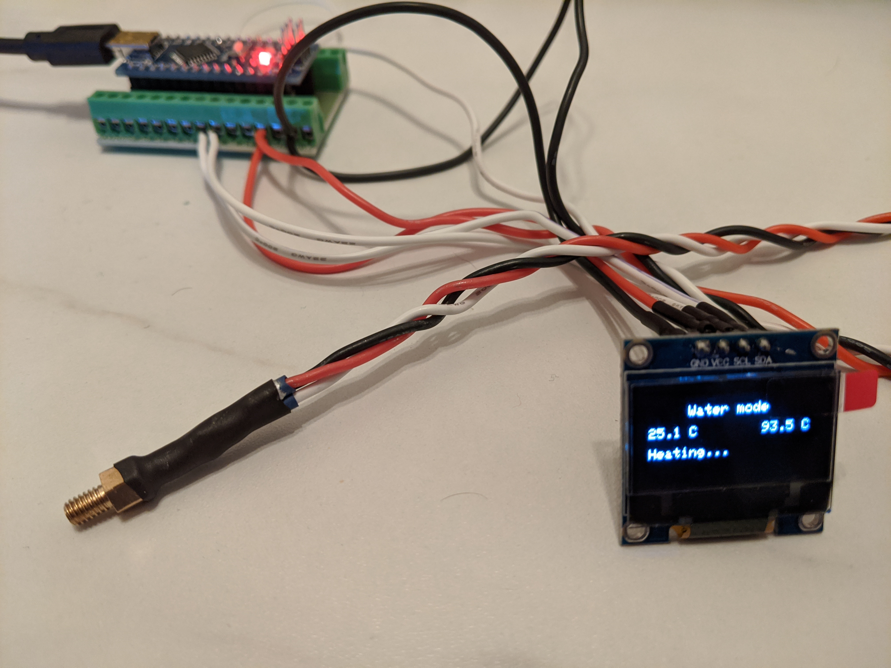
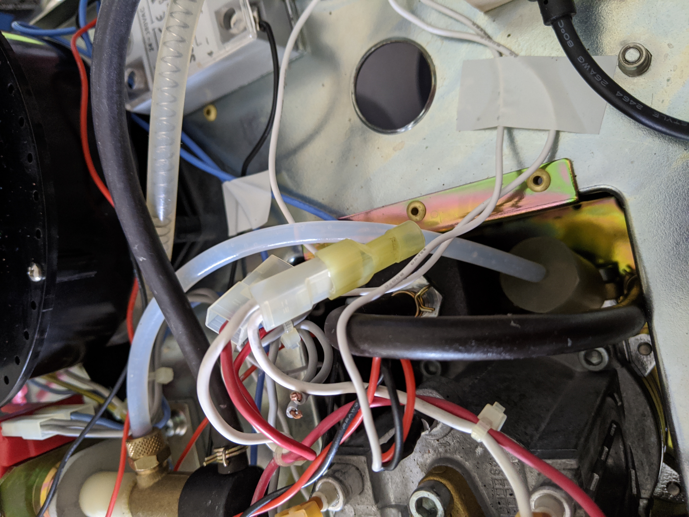
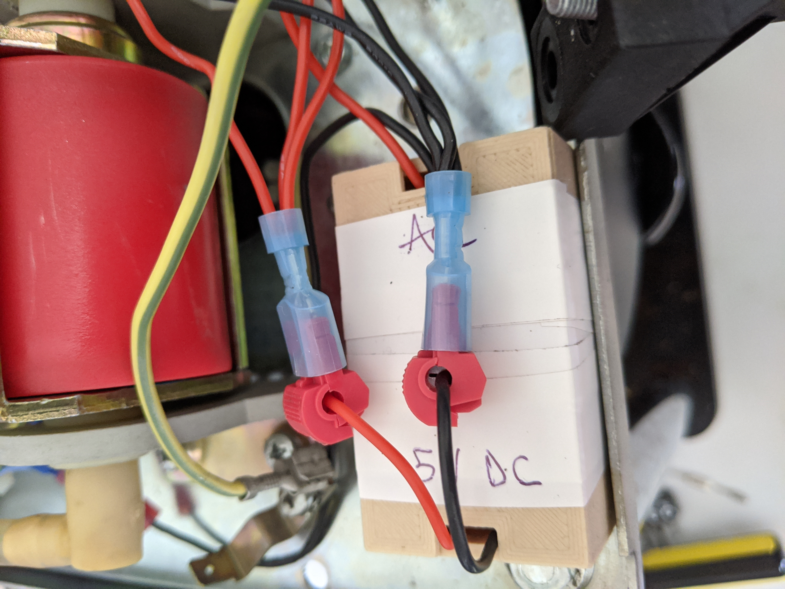
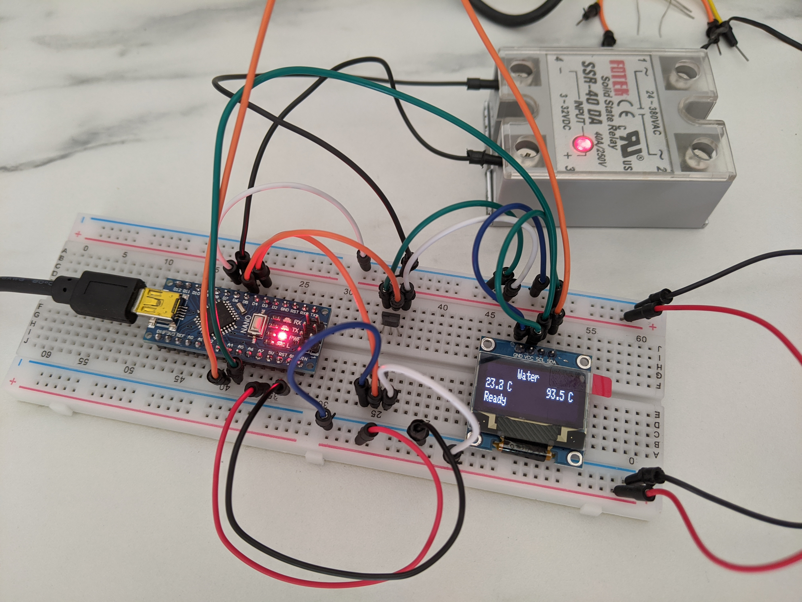

Overview
********

This is the electric diagram of the ``Gaggia Paros``:

    Gaggia Paros electrical wiring

The switches ``5`` and ``6`` represents the two thermostats that are going to be replaced
with two digital temperature sensors and a Solid State Relay that the Arduino MCU will
use to directly control the heater.
The second modification required to allow to target the correct temperature is to
connect Arduino to the left pins of the "double switch" ``13``. This will allow the MCU
to know if the Steam button has been pressed.

This is the list of materials I used for this project. The purpose here is to just give
an idea of what I used and you can change anything as you might prefer. For example I
would be interested to try using K type thermocouples:

* TSic 306 digital temperature sensor (x2)
* 128x64 OLED with SSD1306 controller
* Arduino Nano
* Arduino Nano expansion connection shield
* Fotek clone SSR 40A
* Wires 22AWG (low voltage) and 18AWG (AC line)
* Heat shrinking sleeves
* T-tap (scotch) connectors
* Thermal paste
* M4 brass hexagonal standoff

Arduino
*******

I decided to use an Arduino Nano because of the small size and the USB port which
is handy to upload sketches and interface with the Serial for debuggingand tuning.
I decided to not use a PCB but instead I connected the Arduino to an expansion board that
allows to connect wires with screw connectors without having to solder anything.

.. figure:: images/arduino_nano.jpg
    :align: center
    :alt: Arduino Nano and its expansion board

    Arduino Nano and its expansion board

Temperature sensors
*******************

For this project I decided to use the TSic 306 digital temperature sensor. As suggested
in similar projects there are several benefits: it's digital so no need for ADC or
external bridge boards, max operational temperature is +150deg C which is perfect as the
steam needs to get around 145deg C and it comes in a TO92 package which is quite compact.

.. warning:: How I approached this step is definitely not the best way as there is
   the risk of damaging the sensors. Unfortunately I had to deal with the lack of tools

Fitting the temperature sensor was probably the "hardest" part of this project: the
obstacle here was to figure out how to plug the sensor in the machine's heater. The
stock thermostats are connected through a M4 screw, so following advice from other
similar projects I bought a couple of brass hexagonal standoff with a M4 male thread and
I tried to find a way to assemply the sensors into them.

Unfortunately the TO92 package is 4.5mm wide so I used some sand paper to smooth the
corners of the sensors, trying to not damage the internal electrics. Ideally I would
have drilled the M4 female thread but I do not have a drill at hand :(

I filled the female thread with thermal paste and then I inserted the sensors in the
paste. Eventually I covered everything with a heat shrinking sleeve.

    Temperature sensor assembled

Solid State Relay
*****************

I used one of the common (and cheap) Fotek clone SSR. From what I could read online
these clones usually contain underrated triac, so to stay on the safe side I bought the
40A version with the hope it's not going to blow up.
This type of SSR can be controlled with a signal in the range 3-32 VDC and they update
the output when the AC signal crosses its zero level.

The SSR can be placed inside the coffee machine with it's metal back side on the coffee
machine metal frame in order to dissipate any heat. The control signals are going to be
wired to the Arduino board: one to ``GND`` and one to the selected digital pin.

.. figure:: images/arduino_and_ssr.jpg
    :align: center
    :alt: Arduino Nano and the Fotek SSR

    Arduino Nano and the Fotek SSR

The AC terminals instead needs to be connected to replace the two thermostats. One
themostat is connected to a ``red`` and a ``brown`` whire, while the second one is
connected to a ``white`` and again a ``red`` wire. I connected the SSR terminals using
a piece of 18AWG wire and 2 male space connectors, one to the ``brown`` connector
of the first thermostat and the second one to the ``white`` connector of the other
thermostat.

    Connection between SSR and the heater

Power supply
************

There might be different ways to power the "low voltage" electronic for this project,
at first I thought to use AAA batteries as the overall consumption is very low and the
whole circuit is on only for 30min a day in average.
Eventually I decided to take power from the main AC source using T-Tap connectors and use
an AC-DC switch converter (cheap from Ebay).

.. figure:: images/ttap_connector.jpg
    :align: center
    :alt: TTap connector on AC power line

    TTap connector on AC power line

Using the T-Tap connectors allowed me to not having to cut or solder almost anything, and
everything can still be removed turning the machine back to it's original state.

Eventually I enclosed the whole circuit board in 3D printed plastic case leaving it inside
the coffee machine, as far as possible from any other components. The 5V lines has been
wired to reach the Arduino board and the temperature sensors.

    Power supply enclosure

Display
*******

There is not a constraint on what display you can use, in my case I chose an OLED 128x64.
This display uses the ``SSD1306`` controller and you can find several Arduino libraries
that let you interface with it.
The main reason to choose this type of display was that it uses the I2C protocol so I
only needed 2 Arduino pins to control it (plus 2 to power it up).

Steam button
************

To detect the machine operation mode, the Arduino needs to be connected to the machine
steam mode button. The button has 4 "pins", two by two isolated. It's important to
disconnect the correct two connectors: those that where bypassing the water thermostat
in order to use the steam thermostat which has a higher trigger temperature. The other
two connectors are important because the control the solenoid valve. Use the circuit
diagram to clarify any doubt.

One of the two pins has to be connected to the 5V bus, while the second goes to the
selected Arduino digital pin, which is set to ``INPUT_PULLUP`` mode.

Assembly
********

In this section I'll recap the steps I took from the beginning, until the final
assembly with the PID controller installed in the coffee machine.

Once gathered all the materials for initial testing I wired everything on a breadboard
to verify that the code was working as expected:

    Testbench assembly

This also helped me to find a good starting point for the PID gains, at least better than
leaving them set to ``1``. They have been tuned again once everything was connected to the
machine heater.

First I applied two T-Tap connectors to the main AC power line. one can be applied
to the Neutral just after the input socket, but it's important to connect the second one
**after** the main power button. This allows the Arduino to turn on only when the machine
is on.

The AC-DC converter can be placed into it's plastic container and the AC terminals can
be connected to the two T-Tap connectors. The 5V output is going to be connected the
Arduino, the sensors, the steam mode button and the display.

I then assembled the temperature sensors, fitting them into the hexagonal brass spacers
with the thermal paste and soldering the 22AWG wires to each pin.
Installing them can be tricky, as there is not much space around the heater. Simply
unscrew the thermostats and replace them with the two "homemade" sensors. For the water
sensor, the heater must be freed removing its 4 screws that keeps it connected to the
main group.

I placed the Arduino Nano with the expansion board and a plastic enclosure in the only
available space on the machine frame and I wired the 5V into the ``Vin`` pin, the ``GND``
and the temperature sensors signal wires.

I then positioned the SSR near the coffee grinder, connecting it's DC terminals to ``GND``
and to the Arduino pin, for the AC terminals instead I used 18 AWG wire with male
spade connectors, that have been connected as described in `Solid State Relay`_.

I removed the two connectors from the steam mode button which where used to short circuit
one of the thermostat. I used two T-Tap connectors as "female" space connectors and I
wired them to ``5V`` and the Arduino pin.

Regarding the display, I decided to place it on the front of the machine, between
the amin group and the grinder, where there is a small unused gap. I wired the I2C
signals from the Arduino to the front of the machine and together if ``5V`` and ``GND``
from the power supply, I placed everything at the front of the machine.

Eventually I checked I onnected all the wires to the appropriate port in the Arduino
expansion shield and then I placed the external enclosure on the coffee machine back.

This is how the ``Gaggia Paros`` looks like after the modification:

.. figure:: images/final_mod.jpg
    :align: center
    :alt: Final assembly of the Gaggia Paros

    Final assembly of the Gaggia Paros

The display is going to have a small 3D printed support leveraging the screw at the top
of the black plastic cover, for now it's just hanging there :)

Improvements
************

After a few months of use, everything still seems to be working as expected. The coffee
quality has certainly improved and it's more consistent than before, I really advise
to apply such modification to any coffee machine!

There are still a few things that I'd like to improve:

- Create the display support frame
- Improve the internal wiring, I did not do a good job on that front
- Try out K-type thermocouples instead of the digital sensors
- Replace the Arduino Nano with a ESP8266 based board to have WiFi connectivity

I hope these notes are useful to anybody attempting a similar modification and please
submit Issues or PR on the GitHub repository.
Enjoy the coffee!
