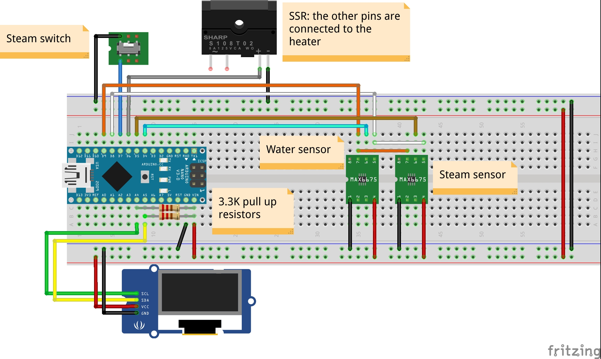
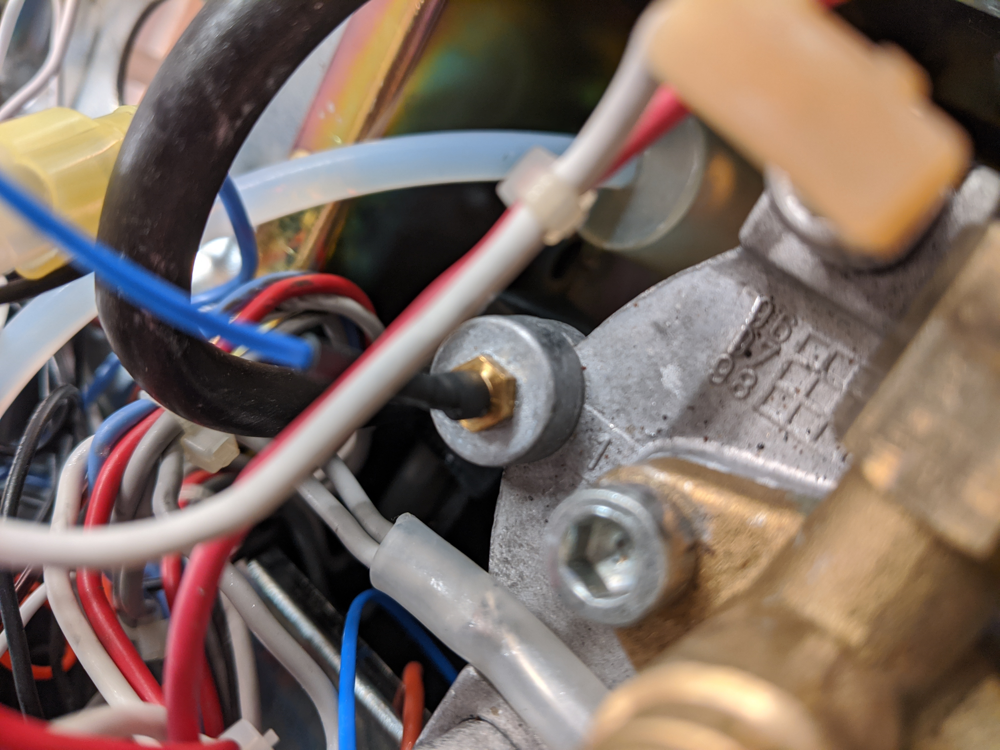
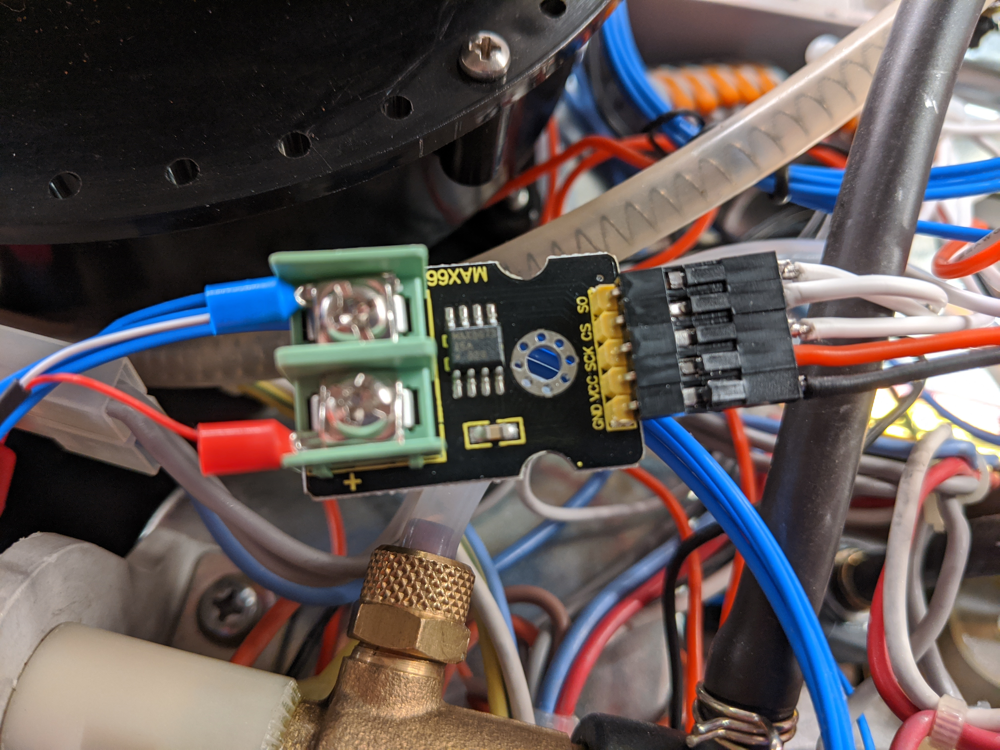
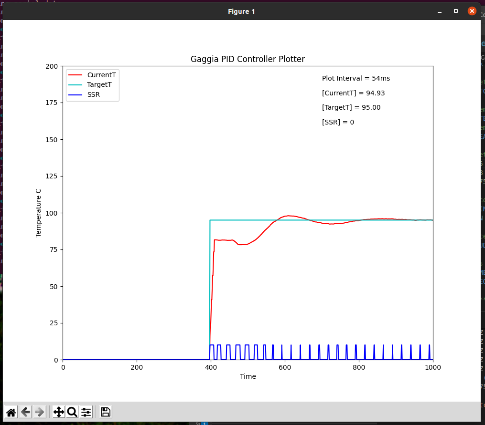

Overview
********

This is the electric diagram of the ``Gaggia Paros``:

    Gaggia Paros electrical wiring

The switches ``5`` and ``6`` represent the two thermostats that are going to be replaced
with two temperature sensors and a Solid State Relay that the Arduino will
use to control the heater.
The second required modification is to connect the Arduino to the left pins of the
"double switch" number ``13``. This will allow the Arduino to know if the Steam button
has been pressed in order to target the correct temperature.

This is the list of materials I used for this project. The purpose here is to just give
an idea of what I used, you can change anything as you might prefer:

* Temperature sensors (x2). I tried with both:
    * TSic 306 digital temperature sensor
    * K-type thermocouple with a MAX6675 ADC module
* 128x64 OLED with SSD1306 controller
* Arduino Nano
* Arduino Nano expansion connection shield
* Fotek clone SSR 40A
* Wires 22AWG (low voltage) and 18AWG (AC line)
* Heat shrinking sleeves
* T-tap (scotch) connectors
* Thermal paste
* M4 brass hexagonal standoff

This is the diagram of all the components connected for testing on a breadboard.
In the diagram the thermocouple sensors are missing and their pins are to be considered
as connected to the two MAX6675 modules.
The same exception is true for the SSR AC pins.

    Breadboard circuit diagram

Arduino
*******

I decided to use an Arduino Nano because of its small size and the USB port which
is handy to upload sketches and interface with the Serial for debugging.
I decided to not use a PCB as most of the components are far from each other and I wanted
to allow easy plug and play of each module.
I then connected the Arduino Nano to an expansion board that allows to connect wires
with screw connectors without having to solder anything.
I 3D printed a simple box to contain and isolate the Arduino from the machine frame.

.. figure:: images/arduino_nano.jpg
    :align: center
    :alt: Arduino Nano and its expansion board

    Arduino Nano and its expansion board

Temperature sensors
*******************

I have tested this whole setup with two different types of sensors:

* TSic306
* K-type thermocouple

TSic306
=======

At first I decided to use the TSic 306 digital temperature sensors. As suggested
in similar projects there are several benefits: it's digital so no need for ADC or
external bridge boards, max operational temperature is +150deg C which is ok as the
steam needs to get around 145deg C and it comes in a TO92 package which is quite compact.

The main challenge I had with these sensors was fitting them in the heater: the
stock thermostats are connected through a M4 screw, so following advice from other
similar projects I bought a couple of brass hexagonal standoff with a M4 male thread and
I tried to find a way to assemply the sensors into them.

Unfortunately the TO92 package is 4.5mm wide so I used some sand paper to smooth the
corners of the sensors, trying to not damage the internal wirings. Ideally I would
have drilled the M4 female thread but I did not have a drill at hand :(

I then filled the female thread with thermal paste and I inserted the sensors in the
paste. Eventually I covered everything with a heat shrinking sleeve.

    Temperature sensor TSic306 assembled

This setup worked very well for several months until I had to do some maintenance to the
machine: removing the heater to replace the solenoid valve I broke one of them.
The problem with this solution was that the two sensors were not really stable
in the brass standoff and it was easy to knock them off by touching them or pulling the
wires.

K-type thermocouple
===================

I then decided to try out two K-type thermocouples. I bought two of those that
come already assembled on an M4 nut (designed for 3D printers) which is handy as this was
the weak point of the previous solution.

The main drawback is that they require a voltage amplifier and an ADC to digitalise the
signal.
Fortunately both of these can be sourced in a single package, the MAX6675 module.
The Arduino can "speak" with the MAX6675 with the SPI protocol requiring 2 more pins
compared to the digital sensor solution. Not a big deal as there are plenty available.

    K-type thermocouples assembled on the heater

    MAX6675 module

Another possible drawback with thermocouple is the error they might be subject to:
again I was not really worried about this because even if there is a ~2deg C error, as
long as it's stable (basically just an offset) it would not impact the PID performances.

Solid State Relay
*****************

I used one of the common (and cheap) Fotek clone SSR. From what I could read online
these clones usually contain underrated triac, so to stay on the safe side I used the
40A version with the hope it's not going to blow up.
This type of SSR can be controlled with a signal in the range 3-32 VDC and they update
the output when the AC signal crosses its zero level.

The SSR can be placed inside the coffee machine with it's metal back side on the coffee
machine metal frame in order to dissipate any heat. The control signals are going to be
wired to the Arduino board: one to ``GND`` and one to the selected digital pin.

.. figure:: images/arduino_and_ssr.jpg
    :align: center
    :alt: Arduino Nano and the Fotek SSR

    Arduino Nano and the Fotek SSR

The AC terminals instead needs to be connected to replace the two thermostats. One
themostat is connected to a ``red`` and a ``brown`` wire, while the second one is
connected to a ``white`` and again a ``red`` wire. I connected the SSR terminals using
a piece of 18AWG wire and 2 male spade connectors, one to the ``brown`` connector
of the first thermostat and the second one to the ``white`` connector of the other
thermostat.

    Connection between SSR and the heater

Power supply
************

There might be different ways to power the "low voltage" electronic for this project,
at first I thought to use AAA batteries as the overall consumption is very low and the
whole circuit is on only for 30min a day in average.
Eventually I decided to take power from the main AC source using T-Tap connectors and use
an AC-DC switch converter (cheap from Ebay).

.. figure:: images/ttap_connector.jpg
    :align: center
    :alt: TTap connector on AC power line

    TTap connector on AC power line

Using the T-Tap connectors allowed me to not having to cut or solder almost anything, and
everything can still be removed reverting the machine back to it's original state.

Eventually I enclosed the whole circuit board in 3D printed plastic case leaving it inside
the coffee machine, as far as possible from any other components. The 5V lines has been
wired to reach the Arduino board and the temperature sensors.

    Power supply enclosure

I also used two clamp wire connectors for the ``5V`` and ``GND`` bus, again this makes
it easier and faster to assemble everything and swap components if required.

.. figure:: images/clamp_wire_connecttors.jpg
    :align: center
    :alt: Clamp wire connectors for 5V and GND

    Clamp wire connectors for 5V and GND

Display
*******

There is not a constraint on what display you can use, in my case I chose an OLED 128x64.
This display uses the ``SSD1306`` controller and you can find several Arduino libraries
that let you interface with it.
The main reason to choose this type of display was that it uses the I2C protocol so I
only needed 2 Arduino pins to control it (plus 2 to power it up).

Steam button
************

To detect the machine operation mode, the Arduino needs to be connected to the machine
steam mode button. The button has 4 "pins", two by two isolated. It's important to
disconnect the correct two connectors: those that where bypassing the water thermostat
in order to use the steam thermostat which has a higher trigger temperature. The other
two connectors are important because the control the solenoid valve.
Use the circuit diagram to clarify any doubt.

One of the two pins has to be connected to ``GND``, while the second goes to the
selected Arduino input digital pin, which must be set to ``INPUT_PULLUP`` mode.

Assembly
********

In this section I'll recap the steps I took from the beginning, until the final
assembly with the PID controller installed in the coffee machine.

Once gathered all the materials for initial testing I wired everything on a breadboard
to verify that the code was working as expected:

    Testbench assembly

This also helped me to find a good starting point for the PID gains, at least better than
leaving them set to ``1``. They have been tuned again once everything was connected to the
machine heater.

First I applied two T-Tap connectors to the main AC power line. one can be applied
to the Neutral just after the input socket, but it's important to connect the second one
**after** the main power button. This allows the Arduino to turn on only when the machine
is on.

The AC-DC converter can be placed into it's plastic container and the AC terminals can
be connected to the two T-Tap connectors. The 5V output is going to be connected to the
Arduino, the sensors and the display.

I then assembled the temperature sensors by unscrewing the thermostats and replacing
them with the two sensors. For the water sensor, the heater must be freed removing its 4
screws that keeps it connected to the main group.

I placed the Arduino Nano with the expansion board and a plastic enclosure in the only
available space on the machine frame and I wired the 5V into the ``Vin`` pin, the ``GND``
and the temperature sensors signal wires.

I then positioned the SSR near the coffee grinder, connecting it's DC terminals to ``GND``
and to the Arduino pin, for the AC terminals instead I used 18 AWG wire with male
spade connectors, that have been connected as described in `Solid State Relay`_.

I removed the two connectors from the steam mode button which where used to short circuit
one of the thermostat. I used two T-Tap connectors as "female" spade connectors and I
wired them to ``GND`` and the Arduino pin.

Regarding the display, I decided to place it on the front of the machine, between
the amin group and the grinder, where there is a small unused gap. I wired the I2C
signals from the Arduino to the front of the machine and together if ``5V`` and ``GND``
from the power supply, I placed everything at the front of the machine.

Eventually I checked I connected all the wires to the appropriate port in the Arduino
expansion shield and then I placed the external enclosure on the coffee machine back.

This is how the ``Gaggia Paros`` looks like after the modification.
The inside:

.. figure:: images/final_mod_inside.jpg
    :align: center
    :alt: Final internal assembly of the Gaggia Paros

    Final internal assembly of the Gaggia Paros

And the outside:

.. figure:: images/final_mod.jpg
    :align: center
    :alt: Final external assembly of the Gaggia Paros

    Final external assembly of the Gaggia Paros

PID Tuning
**********

The last step was improving the PID controller by tuning the gains in order to achieve
the best possible control of the heater.
There are several guides online that explain what each gain does and how to resolve
specific issues, I am not expert so I won't cover this part. My suggestion is to get a
basic understanding of how a PID controller works and then just try changing the gain
values to see the effect.

The Arduino code is configured by default to send the current machine status to the Serial
Interface in a comma separated string format.
In the repository ``tools`` directory there is a Python script that connects to
the machine serial port ``/dev/ttyUSB0`` (a different port can be specified), reading
these messages coming from the Arduino and plotting the water temperature on a graph.

Having a real-time plot of the water temperature will help massively the PID tuning
process, because you will clearly see the oscillations or the overshooting and it will
be easier to correct them.

    PID tuning temperature plot

Improvements
************

After a few months of use, everything still seems to be working as expected. The coffee
quality has certainly improved and it's more consistent than before, I really advise
to apply such modification to any coffee machine!

There are still a few things that I'd like to improve:

- Improve the internal wiring, I did not do a good job on that front
- Replace the Arduino Nano with a ESP8266 based board to have WiFi connectivity

I hope these notes are useful to anybody attempting a similar modification and please
submit Issues or PR on the GitHub repository.

Enjoy the coffee!
